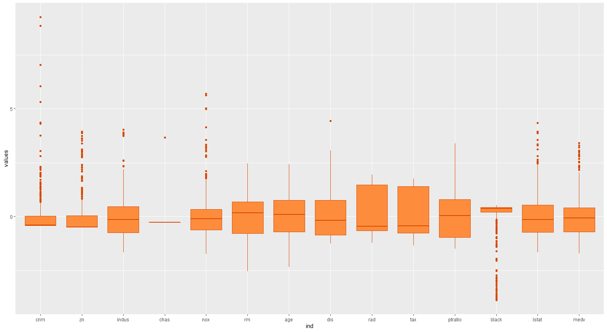

# Statistical Learning Project: Analysis of Boston house price

**NAME:  钱彦兆, 王晨凯** 

**ID: 11711311, 11710619** 

**Grade: Sophomore**


### 1 Introduction

​	 Boston house price is one of the most famous statistic problems in the last century. So we try to analyze the house price through classical statistical methods and find out the major and minor factors that affects the price. According to our goal, linear regression is the best choice. 

​	We collected enough data and did some preprocessing: we randomly selected 2/3 as training data and set the remaining as test data. The training data is used to train the linear model and the test data is used to assess the model.For problems with multiple variables such as Boston house price, there are several typical ways to optimize the model. We tried these optimization methods and found out the  optimum fitting of the problem.


#### 1.1 Datasets

Our data come from an old essay about Boston house price, *Hedonic prices and the demand for clean air* .

We randomly divided the data into two sets: 

- Training set: randomly chosen 2/3 of origin sets,
- Test set: randomly chosen 1/3 of origin sets. 

And we will use test setting to assess our model. Besides, the variable of "chas" is already dummied.


| Variable | Definition                                                   | Source                                       |
| -------- | ------------------------------------------------------------ | -------------------------------------------- |
| medv     | Median Value of owner-occupied                               | 1970 U. S. Census                            |
| rm       | Average number of rooms per dwelling.                        | 1970 U. S. Census                            |
| age      | Proportion of owner-occupied units built prior to 1940.      | 1970 U. S. Census                            |
| black    | 1000(Bk - 0.63)^2 where Bk is the proportion of blacks by own. | 1970 U. S. Census                            |
| lstat    | Lower status of the population(percent).                     | 1970 U. S. Census                            |
| crim     | Per crime rate by town.                                      | FBI (1970)                                   |
| zn       | Proportion of a town's residential land zoned fro lots greater that 25,000 square feet. | Metropolitan Area Planning Commission (1972) |
| indus    | Proportion non-retail business acres per town.               | Vogt, Ivers, and Association                 |
| tax      | Full value property tax rate (\$/\$10,000).                  | Massachusetts Tax-payers Foundation(1970)    |
| ptratio  | Pupil-teacher ratio by town school district                  | Massachusetts Dept. of Education (1971-1972) |
| chas     | Charles River dummy := 1 if tract bounds the Charles River; 0 if otherwise. | 1970 U. S. Census Tract maps                 |
| dis      | Weighted distances to five employment centers in the Boston region. | Schnare                                      |
| rad      | Index of accessibility to radical highways.                  | MIT Boston Project                           |
| nox      | Nitrogen oxides concentration in pphm (annual aver-age concentration in parts per hundred million). | TASSIM                                       |


#### 1.2 Data Visualization

We drew a panel  of scatterplot  for a pair of variables whose identities are given by the corresponding row and column labels.


The box graph of all variables was shown to illustrate the data distribution.


#### 1.3 Data Standardizing

In the Lasso model, we need to use the formula below to standardizing the data:
$$
\widetilde x_{i,j} = \frac{x_{i,j}}{\sqrt{{\frac{1}{n}}\sum_{i=1}^{n}(\frac{x_{i,j}}{x_{i,j}-\bar x_j})^2}}
$$

After standardization, the head of data is shown below:

| zn       | indus    | chas | nox      | rm       | age      | dis      | rad      | tax      | ptratio  | black    | lstat    | medv     |
| -------- | -------- | ---- | -------- | -------- | -------- | -------- | -------- | -------- | -------- | -------- | -------- | -------- |
| 0.808794 | 0.107039 | 0    | 0.024217 | 0.301427 | 3.285297 | 0.185721 | 0.04567  | 6.304818 | 0.727945 | 7.082784 | 0.231909 | 1.148223 |
| 0        | 0.34765  | 0    | 0.022368 | 0.312204 | 4.19072  | 0.239091 | 0.096855 | 5.145127 | 0.899769 | 7.060669 | 0.451788 | 1.09814  |
| 0        | 0.351682 | 0    | 0.022624 | 0.353389 | 3.272702 | 0.241842 | 0.097973 | 5.136803 | 0.910231 | 6.976837 | 0.201515 | 1.784631 |
| 0        | 0.110867 | 0    | 0.022595 | 0.351951 | 2.479367 | 0.301846 | 0.150278 | 4.680136 | 0.977038 | 6.96521  | 0.150288 | 1.754769 |
| 0        | 0.110153 | 0    | 0.022443 | 0.357083 | 2.930941 | 0.299832 | 0.149284 | 4.696069 | 0.971178 | 7.026242 | 0.270726 | 1.890694 |

The box graph of those data after standardizing is shown below:



#### 1.3 Model assess

We use some statistical concept to assess our model:

1. **Residual Standard Error**
$$
RSE = \sqrt[]{\frac{RSS}{n-2}}
$$

​		Where RSS(residual sum of squares) is:
$$
RSS = \sum_{i=1}^{n}(y_i - \hat{y}_i)^2
$$

2. **R^2^ Statistic**
$$
R^2 = \frac{TSS-RSS}{TSS} = 1 - \frac{RSS}{TSS}
$$
​		Where TSS(total sum of squares) is:
$$
TSS = \sum_{i=1}^{n}(y_i - \bar{y}_i)^2
$$

3. **Adjusted-R^2^ statistic**

$$
R^2 = \frac{TSS-RSS}{TSS} = 1 - \frac{RSS/(n-d-1)}{TSS/(n-1)}
$$

### 2 Model Selection and Implementation

​	Our goal is finding out the major and minor factors that affect the price. Although the linear model is more restrictive,  linear model is of good explanatory, so the linear model is the best choice. Assuming that we don't choose a linear model, but choose other models with higher flexibility, we need to train the model with much bigger data than the training data used in  linear model  and the model we get is difficult to explain how any individual predictor is associated with the response.

#### 2.1 Full Model

In full model, we take 13 variables into consideration. From the result of regression, it is shown that only few varibles play the major part in Boston house price. Therefore, it is urgent to improve the model. Statistics of full model are attached below.

|           | Estimate  | Std.Error | t value | Pr(>\|t\|) |
| --------- | --------- | --------- | ------- | ---------- |
| intercept | 0.210528  | 0.252044  | 0.835   | 0.404177   |
| crim      | -0.048952 | 0.053972  | -0.907  | 0.365087   |
| zn        | 0.028821  | 0.014665  | 1.965   | 0.050246   |
| indus     | 0.026266  | 0.063904  | 0.411   | 0.681325   |
| chas      | 0.096118  | 0.031029  | 3.098   | 0.002122   |
| nox       | -8.215957 | 4.023916  | -2.042  | 0.041985   |
| rm        | 7.433033  | 0.455925  | 16.303  | <0.0001    |
| age       | -0.028337 | 0.012587  | -2.251  | 0.025042   |
| dis       | -1.195338 | 0.210403  | -5.681  | <0.0001    |
| rad       | 0.345224  | 0.093474  | 3.693   | 0.000260   |
| tax       | -0.041890 | 0.012559  | -3.335  | 0.000951   |
| ptratio   | -0.742733 | 0.125414  | -5.922  | <0.0001    |
| black     | 0.031737  | 0.008901  | 3.565   | 0.000418   |
| lstat     | -0.285383 | 0.059129  | -4.826  | <0.0001    |

|               | RSE    | $R^2$  | Adjusted $R^2$ |
| :-----------: | ------ | ------ | -------------- |
| training data | 0.1508 | 0.8762 | 0.8712         |
|   test data   | 0.1106 | 0.8324 | 0.8172         |

#### 2.2 Stepwise Selection

First, we sorted the variable through stepwise selection and we got the order of variables  in order of importance. Therefore, we choose the first seven major variables, which are showed below.

```
   crim zn  indus chas nox rm  age dis rad tax ptratio black lstat
1  ( 1 )  " "  " " " "   " "  " " "*" " " " " " " " " " "     " "   " "  
2  ( 1 )  " "  " " " "   " "  " " "*" " " " " " " " " "*"     " "   " "  
3  ( 1 )  " "  " " " "   " "  " " "*" " " " " " " " " "*"     " "   "*"  
4  ( 1 )  " "  " " " "   " "  " " "*" " " " " " " " " "*"     "*"   "*"  
5  ( 1 )  " "  " " " "   " "  " " "*" " " "*" " " " " "*"     "*"   "*"  
6  ( 1 )  " "  " " " "   " "  " " "*" "*" "*" " " " " "*"     "*"   "*"  
7  ( 1 )  " "  " " " "   "*"  " " "*" "*" "*" " " " " "*"     "*"   "*"  
8  ( 1 )  " "  " " " "   "*"  " " "*" "*" "*" "*" " " "*"     "*"   "*"  
9  ( 1 )  " "  " " " "   "*"  " " "*" "*" "*" "*" "*" "*"     "*"   "*"  
10  ( 1 ) " "  " " " "   "*"  "*" "*" "*" "*" "*" "*" "*"     "*"   "*"  
11  ( 1 ) " "  "*" " "   "*"  "*" "*" "*" "*" "*" "*" "*"     "*"   "*"  
12  ( 1 ) "*"  "*" " "   "*"  "*" "*" "*" "*" "*" "*" "*"     "*"   "*"  
13  ( 1 ) "*"  "*" "*"   "*"  "*" "*" "*" "*" "*" "*" "*"     "*"   "*" 
```


|           | Estimate  | Std.Error | t value | Pr(>\|t\|) |
| --------- | --------- | --------- | ------- | ---------- |
| intercept | -0.340526 | 0.061531  | -5.534  | <0.0001    |
| rm        | 8.262658  | 0.279706  | 29.541  | <0.0001    |
| age       | -0.040181 | 0.012491  | -3.217  | 0.00142    |
| dis       | -0.920175 | 0.171070  | -5.379  | <0.0001    |
| ptratio   | -0.709611 | 0.105491  | -6.727  | <0.0001    |
| black     | 0.035939  | 0.006729  | 5.341   | <0.0001    |
| lstat     | -0.278504 | 0.055662  | -5.004  | <0.0001    |


|               | RSE    | $R^2$  | Adjusted $R^2$ |
| ------------- | ------ | ------ | -------------- |
| training data | 0.1573 | 0.8624 | 0.8599         |
| test data     | 0.1521 | 0.6830 | 0.6692         |

#### 2.3 Lasso Model

  The second term of the equation,$\lambda\sum_{j=1}^{p}\vert\beta_j\vert$,called the shrinkage penalty, has the effect of shrinking the estimates of $\beta_j$towars zero. The turning parameter $\lambda$ serves to control the relative impact of these two terms on the regression coefficient estimates.

$$
\sum_{i=1}^{n}(y_i - \beta_0 - \sum_{j=1}^{p}\beta_jx_{ij})^2 + \lambda\sum_{j=1}^{p}\vert\beta_j\vert = RSS + \lambda\sum_{j = 1}^{p}\vert\beta_j\vert
$$


test

$R^{2} = 0.7823308  $            $RSE = $ 0.1260907         $Adjusted-R^2 = 0.7625427$

train

$R^{2} = 0.7941389  $            $RSE = $ 0.1914669         $Adjusted-R^2 = $0.7851884


Some of those coefficients go to zero denpending on the choice of tuning parameter.


We can also see the Mean-Value Error becomes bigger as $\lambda$ becomes larger.


And the $\lambda%$ was chosen as:
$$
\lambda = 0.0003384039
$$


|               | RSE    | $R^2$  | Adjusted $R^2$ |
| ------------- | ------ | ------ | -------------- |
| training data | 0.1915 | 0.7941 | 0.7852         |
| test data     | 0.1261 | 0.7823 | 0.7625         |


### 3 Assess the Model

We compare the effect of the three regression model and illustrate them.


From the two graph above, we can draw two main conclusion: one  is that the full model fits the data best, another is stepwise regression overfits the training data.


### References

[1] Harrison, D. and Rubinfeld, D.L. (1978) Hedonic prices and the demand for clean air. J. Environ. Economics and Management 5, 81–102.


### Appendix

#### codes for computing statistics

~~~R
RSE = function(y, x, beta){
    a = sqrt(RSS(y,x,beta)/(length(y)-2))
    print(a)
    return(a)
}

R_square = function(y, x, beta){
    TSS = TSS(y)
    RSS = RSS(y, x, beta)
    r = 1- RSS/TSS
    print(r)
    return(r)
}

Adjusted_R_square = function(y, x ,beta){
    TSS = TSS(y)
    RSS = RSS(y, x, beta)
    r = 1- RSS*(length(y)-1) / ((length(y)-1-length(beta))*TSS)
    print(r)
    return(r)
}
    
RSS = function(y, x, beta){
    y_hat = c()
    for (i in 1:length(y)){
        temp = 0
        for (j in 2: length(beta)){
            temp = temp + x[i,j-1] * beta[j]
        }
       y_hat[i] = temp + beta[1] 
    }
    return(sum((y-y_hat)^2))
}

TSS = function(y){
    sum((y - median(y))^2)
}

~~~

#### codes for standardizing the data

````R
standardizing = function(x0){
    chas = x0[,4]
    x = x0[,-4]
    n = dim(x)[1]
    p = dim(x0)[2]
    x_ <- x
    for (j in 1:dim(x)[2]){
        x_bar = median(x[,j])
        for (i in 1:dim(x)[1]){
            sq = sum((x[i,]-x_bar)^2)
            x_[i,j] = x[i,j]/sqrt(1/n* sq)
        }
    }
    x_new = cbind(x_[,1:3], chas, x_[,5:p-1])
}
````

#### codes for data separating 

```R
# The function was used to seperate data into training sets and test sets
set.seed(1)
sub<-sample(1:nrow(Boston),round(nrow(Boston)*2/3))
length(sub)
data_train<-Boston[sub,]# get 2/3 of data as training sets
data_test<-Boston[-sub,]# get 1/3 of data as test sets
dim(data_train)
dim(data_test) 
head(data_train)
head(data_test)
write.table(data_train, file = "data/data_train.csv", append = FALSE, quote = TRUE, sep = ",",
            eol = "\n", na = "NA", dec = ".", row.names = FALSE,
            col.names = TRUE, qmethod = c("escape", "double"),
            fileEncoding = "")
write.table(data_test, file = "data/data_test.csv", append = FALSE, quote = TRUE, sep = ",",
            eol = "\n", na = "NA", dec = ".", row.names = FALSE,
            col.names = TRUE, qmethod = c("escape", "double"),
            fileEncoding = "")

```

#### codes for model fitting

```R
# Loading standarding data
train_stand = read.table("data/train_stand.csv", header = T, na.string = "?", sep = ",")
test_stand = read.table("data/test_stand.csv", header = T, na.string = "?", sep = ",")

### Full Model
pairs(train_stand)
lm.full = lm(medv~., data = train_stand)
summary(lm.full)

beta_full = coefficients(lm.full)
R_2_full = R_square(test_stand[,ncol(test_stand)], test_stand[,1:ncol(test_stand)-1], beta_full)
RSE_full = RSE(test_stand[,ncol(test_stand)], test_stand[,1:ncol(test_stand)-1], beta_full) 
Adjusted_R_2_full = Adjusted_R_square(test_stand[,ncol(test_stand)], test_stand[,1:ncol(test_stand)-1], beta_full)


### Backward Model
regfit.bwd = regsubsets(medv~.,data=train_stand ,nvmax=19, method="backward")
summary(regfit.bwd)

lm.bwd = lm(medv~rm + age + dis + ptratio + black + lstat, data = train_stand)
summary(lm.bwd)

beta_bwd =coefficients(lm.bwd)
test_stand_1 = test_stand[,-10][,-9][,-5][,-4][,-3][,-2][,-1]
R_2_bwd = R_square(test_stand[,ncol(test_stand)], test_stand_1, beta_bwd)
RSE_bwd = RSE(test_stand[,ncol(test_stand)], test_stand_1, beta_bwd) 
Adjusted_R_2_bwd = Adjusted_R_square(test_stand[,ncol(test_stand)], test_stand_1, beta_bwd)


### Lasso adjusted
library(Matrix)
library(foreach)
library(glmnet)
x_train = model.matrix(medv~., train_stand)[,-1]
x_test = model.matrix(medv~., test_stand)[,-1]
y_train = train_stand$medv
y_test = test_stand$medv

grid = 10^seq(10, -2, length = 100)
lasso.mod=glmnet(x_train,y_train,alpha=1,lambda=grid)
plot(lasso.mod)

set.seed(1)
cv.out = cv.glmnet(x_train, y_train, alpha = 1)
plot(cv.out)

bestlam=cv.out$lambda.min

lasso.pred=predict(lasso.mod,s=bestlam ,newx=x_test)
plot(lasso.pred)
mean((lasso.pred -y_test)^2)
print(bestlam)

#coefficients 
Beta_lasso = predict(lasso.mod,type="coefficients",s=bestlam)


R_2_lasso = R_square(y_test,x_test, beta_lasso)
RSE_lasso = RSE(y_test,x_test, beta_lasso)
Adjusted_R_2_Lasso = Adjusted_R_square(y_test, x_test, beta_lasso)


R_2_lasso = R_square(y_train, x_train, beta_lasso)
RSE_lasso = RSE(y_train,x_train, beta_lasso)
Adjusted_R_2_Lasso = Adjusted_R_square(y_train, x_train, beta_lasso)

### Lasso + Stepwise

x_train = model.matrix(medv~rm + age + dis + ptratio + black + lstat, train_stand)[,-ncol(train_stand)]
x_test = model.matrix(medv~rm + age + dis + ptratio + black + lstat, test_stand)[,-ncol(test_stand)]
y_train = train_stand$medv
y_test = test_stand$medv

grid = 10^seq(10, -2, length = 100)
lasso.mod=glmnet(x_train,y_train,alpha=1,lambda=grid)
plot(lasso.mod)

set.seed(1)
cv.out = cv.glmnet(x_train, y_train, alpha = 1)
plot(cv.out)

bestlam=cv.out$lambda.min

lasso.pred=predict(lasso.mod,s=bestlam ,newx=x_test)
mean((lasso.pred -y_test)^2)
print(bestlam)

#coefficients 
Beta_lasso = predict(lasso.mod,type="coefficients",s=bestlam)


R_2_lasso = R_square(test_stand, x_test, beta_lasso)
RSE_lasso = RSE(y_test,x_test, beta_lasso)
Adjusted_R_2_Lasso = Adjusted_R_square(y_test, x_test, beta_lasso)


R_2_lasso = R_square(y_train, x_train, beta_lasso)
RSE_lasso = RSE(y_train,x_train, beta_lasso)
Adjusted_R_2_Lasso = Adjusted_R_square(y_train, x_train, beta_lasso)

```


